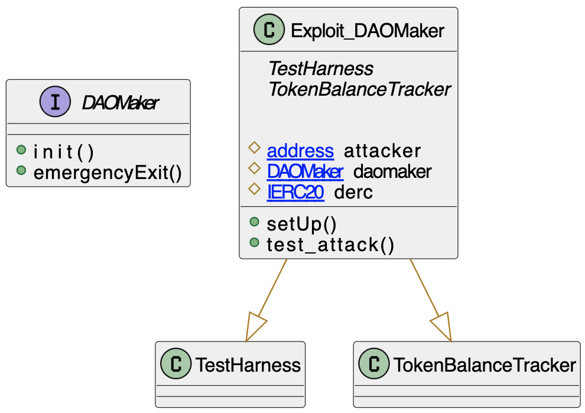

# DAO maker

- Type: Exploit
- Total lost: ~4MM
- Category: Access Control
- Exploited contracts:
- - https://etherscan.io/address/0x2FD602Ed1F8cb6DEaBA9BEDd560ffE772eb85940
- Attack transactions: 
- - https://etherscan.io/tx/0x96bf6bd14a81cf19939c0b966389daed778c3a9528a6c5dd7a4d980dec966388 
- Attack Block: 13155350 
- Date: Sep 03, 2021
- Reproduce: `forge test --match-contract Exploit_DAOMaker -vvv`

## Step-by-step 
1. Call `init` to set yourself as owner
2. Call `emergencyExit` to withdraw tokens

## Detailed Description
On Sept 03, 2021 an attacker stole over 4MM USD in various tokens from an DAOMaker.

The attacker called `init`, which is not access-controlled, and then called `emergencyExit` withdrawing the tokens held.

The vulnerability is hard to detect as contracts were not verified, thus the source code is not readily available.

Nevertheless, we can see the [first attack tx](https://etherscan.io/tx/0xd5e2edd6089dcf5dca78c0ccbdf659acedab173a8ab3cb65720e35b640c0af7c) calls an init method with a sighash `84304ad7`. 
The exploited contract is simply a universal-proxy-like, which delegates call to an implementation that holds the actual upgrade logic. This implementation contract didn't not prevent an arbitrary address to call its `init` method.

The `init` method sets as `owner` anyone who calls it. You can check [the decompilation]( https://etherscan.io/bytecode-decompiler?a=0xf17ca0e0f24a5fa27944275fa0cedec24fbf8ee2) and look for the `unknown84304ad7` method, as the decompiler calls it. Look at the bottom, you will see `owner = caller`.

We can be sure this transaction triggered because there is [an event in the event list]( https://etherscan.io/address/0x2fd602ed1f8cb6deaba9bedd560ffe772eb85940#events). See that the first one sets it from zero to an OK address, then after a while fron the OK address to the attacker's.

This allowed the attacker to call `emergencyExit` (sighash: `a441d067`) which is `onlyOwner` protected.

In his [twitter thread](https://twitter.com/Mudit__Gupta/status/1434059922774237185), Mudit Gupta suggests that the attacker was using a browser wallet as the calls where made separeterly without a contract and the browser wallet built-in swap was used.

Also, the contract attacked was not verified. The fact that the attacker used only an EOA to perform the attack on a non verified contract suggests that maybe the attacker had insider-knowledge of this vulnerability.

## Possible mitigations
- `initialize` functions should always be protected so they can be called only once

## Diagrams and graphs

### PlantUML

## Sources and references
- [Mudit Gupta Twitter Thread](https://twitter.com/Mudit__Gupta/status/1434059922774237185)
