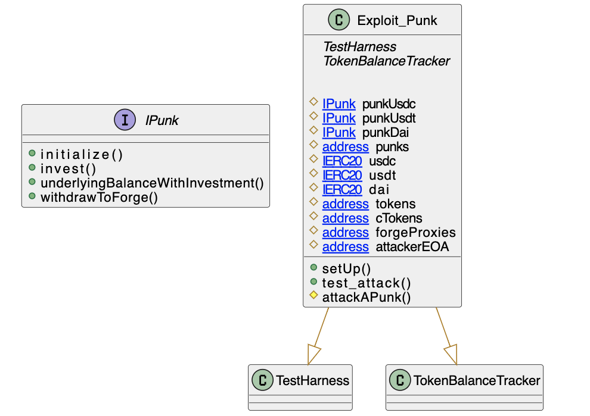

# Punk Protocol

- **Type:** Exploit
- **Network:** Ethereum
- **Total lost**: ~6MM (lost: 3MM USDT + 3MM USDC + 2.95MM DAI, recovered: 3MM USDT, 1.95MM DAI)
- **Category:** Access Control
- **Exploited contracts:**
- - Punk USDC: https://etherscan.io/address/0x3BC6aA2D25313ad794b2D67f83f21D341cc3f5fb 
- - Punk USDT: https://etherscan.io/address/0x1F3b04c8c96A31C7920372FFa95371C80A4bfb0D
- - Punk DAI: https://etherscan.io/address/0x929cb86046E421abF7e1e02dE7836742654D49d6
- **Attack transactions:**
- - https://etherscan.io/tx/0x7604c7dd6e9bcdba8bac277f1f8e7c1e4c6bb57afd4ddf6a16f629e8495a0281 
- **Attack Block:** 12995895 
- **Date:** Aug 10, 2021
- **Reproduce:** `forge test --match-contract Exploit_Punk -vvv`

## Step-by-step 
1. Call `init` to set yourself as owner
2. Call `withdrawToForge` to withdraw tokens

## Detailed Description
The Punk protocol pools did not prevent someone from calling `initialize` after
the contracts were already initialized.

The attacker called `initialize` throught the proxy and set their own `forge_` address, which allowed them to later call `withdrawToForge`, which, as the name implies, withdraws all the funds to the forge address.

``` solidity
    function initialize( 
        address forge_, 
        address token_,
        address cToken_, 
        address comp_, 
        address comptroller_,
        address uRouterV2_ ) public {
    }
```

## Possible mitigations
- `initialize` functions should always be protected so they can be called only once

## Diagrams and graphs

### Entity and class diagram


## Sources and references
- [Rekt News Report](https://rekt.news/punkprotocol-rekt/)
- [Postmortem](https://medium.com/punkprotocol/punk-finance-fair-launch-incident-report-984d9e340eb)
