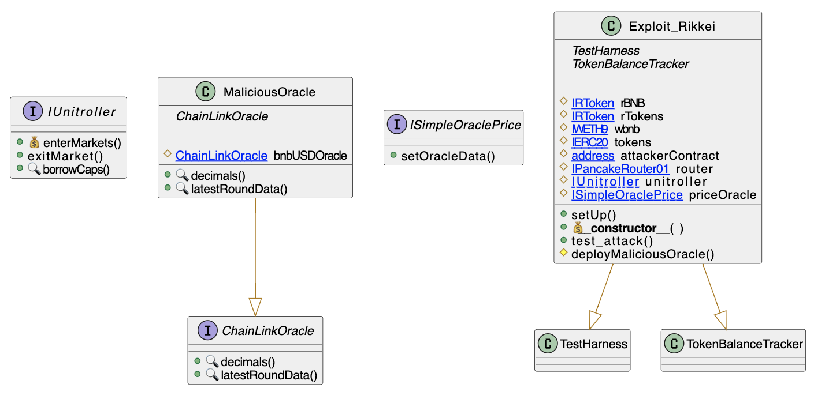

# Rikkei Oracle Replace
- **Type:** Exploit
- **Network:** Binance Smart Chain
- **Total lost**: 1MM
- **Category:** Access Control
- **Exploited contracts:**
- - Price Oracle: https://bscscan.com/address/0xd55f01b4b51b7f48912cd8ca3cdd8070a1a9dba5
- **Attack transactions:**
- - https://bscscan.com/tx/0x93a9b022df260f1953420cd3e18789e7d1e095459e36fe2eb534918ed1687492
- **Attack Block:** 16956475 
- **Date:** Apr 15, 2021
- **Reproduce:** `forge test --match-contract Exploit_Rikkei -vvv`

## Step-by-step 
1. Call `setOracleData` to set your own oracle for a token
2. Take favorable loans using the malicious price

## Detailed Description
The Rikkei Oracle contract did not prevent someone from calling their `setOracleData` function.

``` solidity
    function setOracleData(address rToken, oracleChainlink _oracle) external {
        oracleData[rToken] = _oracle;
    }
```

Once a malicious oracle is set (the attacer's is [here](https://bscscan.com/address/0xA36F6F78B2170a29359C74cEFcB8751E452116f9#code
)), the attacker can get loans for a monstruous amount of money with little to no collateral.

The attacker:
1. Put 0.0001 BNB to get 4995533044307110.024 rBNB.
2. Took a loan of 346199.781 USDC with the rBNB.
3. Exchanged the USDC for 776.298 WBNB
4. Repeated this process with all stablecoins available
6. Restored Oracle
7. Exit the WBNB through Tornado Cash


## Possible mitigations
- The `setOracleData` had to be either `internal` or authenticated.

## Diagrams and graphs

### Entity and class diagram


## Sources and references
- [Known Sec Labs Report](https://knownseclab.com/news/625e865cf1c544005a4bdaf2)
