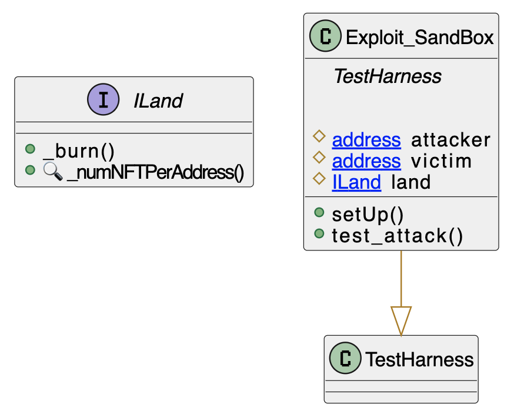

# Sandbox Public Burn 
- **Type:** Exploit
- **Network:** Ethereum
- **Total lost**: 1 NFT (unknown price)
- **Category:** Access Control
- **Exploited contracts:**
- - Sandbox LAND: https://etherscan.io/address/0x50f5474724e0Ee42D9a4e711ccFB275809Fd6d4a
- **Attack transactions:**
- - https://etherscan.io/tx/0x34516ee081c221d8576939f68aee71e002dd5557180d45194209d6692241f7b1
- **Attack Block:** 14163042
- **Date:** Feb 08, 2022
- **Reproduce:** `forge test --match-contract Exploit_Sandbox -vvv`

## Step-by-step 
1. Find a player you don't like
2. Call `_burn` with `(enemyAddress, enemyAddress, id)`
3. You have destroyed your enemy NFT

## Detailed Description
The Sandbox Land contract has a `_burn` method that destroys an NFT.

``` solidity
    function _burn(address from, address owner, uint256 id) public {
        require(from == owner, "not owner");
        _owners[id] = 2**160; // cannot mint it again
        _numNFTPerAddress[from]--;
        emit Transfer(from, address(0), id);
    }
```


The method apparently intends to authenticate the `burn`, but does so using 
parameters to the function instead of `msg.sender`. This leads to the attack being
quite trivial: the attacker just sends `from == owner`.

## Possible mitigations
- Use `msg.sender` instead of the function parameter `from`

## Diagrams and graphs

### Entity and class diagram


## Sources and references
- [Slowmist Post] (https://slowmist.medium.com/the-vulnerability-behind-the-sandbox-land-migration-2abf68933170)
