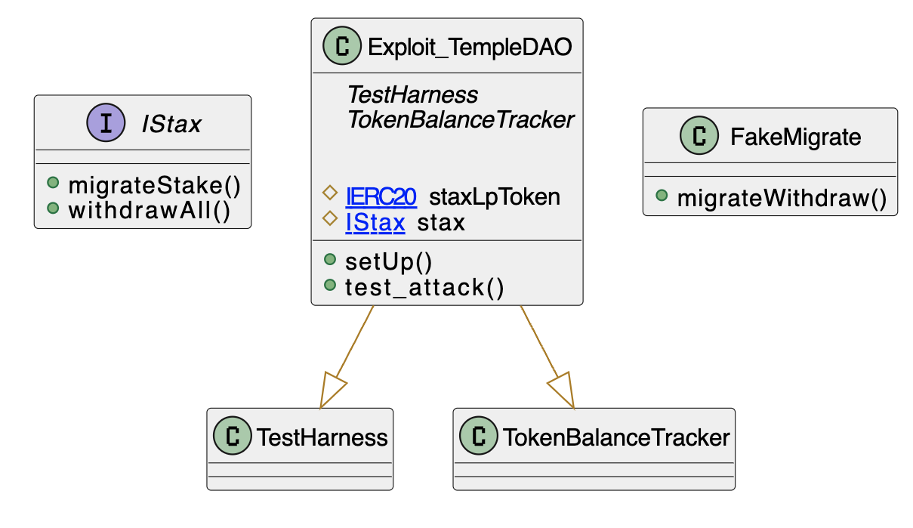

# TempleDAO Spoof Old Staking Contract
- **Type:** Exploit
- **Network:** Ethereum
- **Total lost**: ~2.3MM USD
- **Category:** Access Control
- **Exploited contracts:**
- - https://etherscan.io/address/0xd2869042E12a3506100af1D192b5b04D65137941
- **Attack transactions:**
- - https://etherscan.io/tx/0x8c3f442fc6d640a6ff3ea0b12be64f1d4609ea94edd2966f42c01cd9bdcf04b5
- **Attack Block:**: 15725067
- **Date:** Oct 11, 2022
- **Reproduce:** `forge test --match-contract Exploit_TempleDAO -vvv`

## Step-by-step 
1. Create a contract that does not revert when receiving a call to `migrateWithdraw`
2. Call `migrateStake(evilContract, MAX_UINT256)` and get a lot of tokens.

## Detailed Description
The protocol wanted to allow users to migrate stake from an old contract to a new one. To do that, they provided a `migrateStake` function:

``` solidity
    function migrateStake(address oldStaking, uint256 amount) external {
        StaxLPStaking(oldStaking).migrateWithdraw(msg.sender, amount);
        _applyStake(msg.sender, amount);
    }
```

An OK implementation of `migrateWithdraw` should transfer `amount` from `msg.sender` to the current contract. `_applyStake` would later add `amount` to `msg.sender`.

Unfortunately, it is trivial to pass an evil `oldStaking` contract that approves any amount.

## Possible mitigations
- Store a list of valid `oldStaking` contract addresses and whitelist them (needs an `owner` if the list needs to be dynamic)

## Diagrams and graphs

### Entity and class diagram


## Sources and references
- [BlockSecTeam Twitter Thread](https://twitter.com/BlockSecTeam/status/1579843881893769222)
