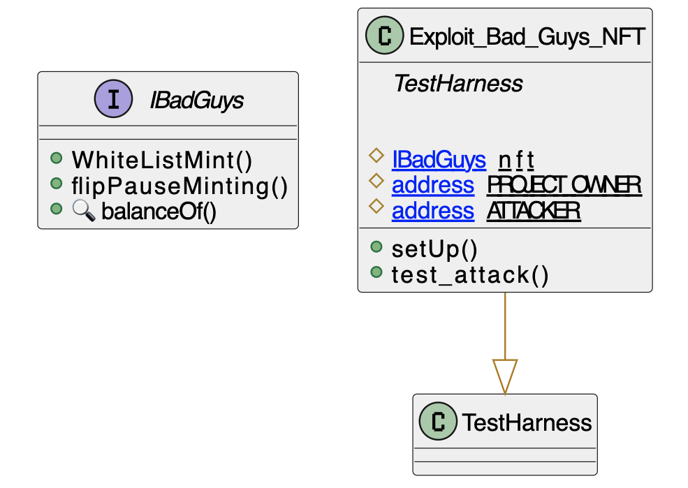

# Bad Guys NFT
- **Type:** Exploit
- **Network:** Ethereum
- **Total lost**: 400 NFTs were claimed
- **Category:** Data validation
- **Exploited contracts:**
- -  [0xb84cbaf116eb90fd445dd5aeadfab3e807d2cbac](https://etherscan.io/address/0xb84cbaf116eb90fd445dd5aeadfab3e807d2cbac)
- **Attack transactions:**
- - https://etherscan.io/tx/0xb613c68b00c532fe9b28a50a91c021d61a98d907d0217ab9b44cd8d6ae441d9f
- **Attack Block:**: 15460094  
- **Date:** Sept 02, 2022
- **Reproduce:** `forge test --match-contract Exploit_Bad_Guys_NFT -vvv`

## Step-by-step 
1. Get whitelisted
2. Call the whitelist mint function with a high number of `chosenAmount`  so you mint all available NFTs.

## Detailed Description
The attacker claimed 400 NFTs in a single transaction. The mistake is in the `WhiteListMint` function, where anyone whitelisted can pass an arbitrary `chosenAmount`. The `_numberMinted_` map is only updated after calling the function, so the `require` passes for any number on the first try.

```solidity
    function WhiteListMint(bytes32[] calldata _merkleProof, uint256 chosenAmount)
        public
    {
        require(_numberMinted(msg.sender)<1, "Already Claimed");
        require(isPaused == false, "turn on minting");
        require(
            chosenAmount > 0,
            "Number Of Tokens Can Not Be Less Than Or Equal To 0"
        );
        require(
            totalSupply() + chosenAmount <= maxsupply - reserve,
            "all tokens have been minted"
        );
        bytes32 leaf = keccak256(abi.encodePacked(msg.sender));
        require(
            MerkleProof.verify(_merkleProof, rootHash, leaf),
            "Invalid Proof"
        );
        _safeMint(msg.sender, chosenAmount);
    }


```

## Possible mitigations
- The `chosenAmount` parameter seems to be useless and would better be a constant of `1` if that was the intended usage.
- Otherwise, if it was intended to allow for more than one mint per accoutn, restrict the `chosenAmount` parameter.

## Diagrams and graphs

### Class



## Sources and references
- [RugDoctorApe Twitter Thread](https://twitter.com/RugDoctorApe/status/1565739119606890498)
