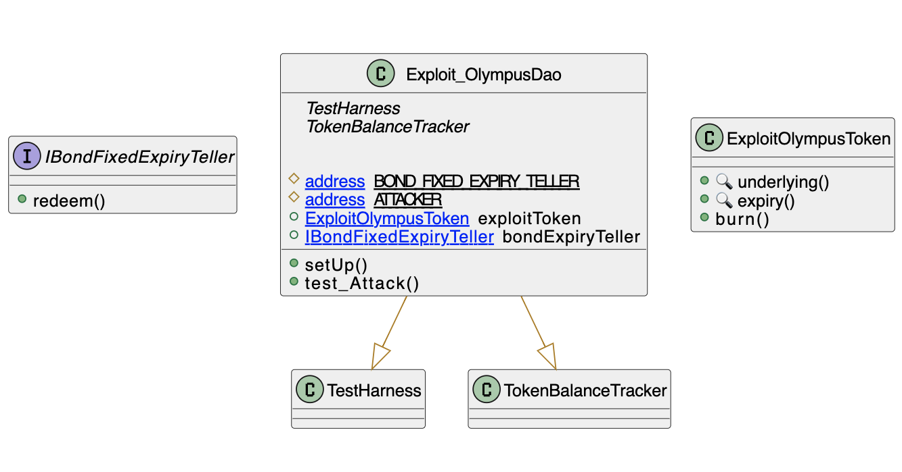

# Bond Olympus DAO
- **Type:** Exploit
- **Network:** Ethereum
- **Total lost**: 30,437 OHM ~= 300K USD (returned later)
- **Category:** Data validation
- **Exploited contracts:**
- - [0x007FE7c498A2Cf30971ad8f2cbC36bd14Ac51156](https://etherscan.io/address/0x007FE7c498A2Cf30971ad8f2cbC36bd14Ac51156)
- **Attack transactions:**
- - [0x3ed75df83d907412af874b7998d911fdf990704da87c2b1a8cf95ca5d21504cf](https://etherscan.io/tx/0x3ed75df83d907412af874b7998d911fdf990704da87c2b1a8cf95ca5d21504cf)
- **Attacker Addresses**: 
- - EOA: [0x443cf223e209E5A2c08114A2501D8F0f9Ec7d9Be](https://etherscan.io/address/0x443cf223e209E5A2c08114A2501D8F0f9Ec7d9Be)
- - Contract: 
[0xa29e4fe451ccfa5e7def35188919ad7077a4de8f](https://etherscan.io/address/0xa29e4fe451ccfa5e7def35188919ad7077a4de8f)
- **Attack Block:**: 15794364
- **Date:** Oct 21, 2022
- **Reproduce:** `forge test --match-contract Exploit_OlympusDAO -vvv`

## Step-by-step 
1. Craft and deploy a contract so that it passes the requirements.
2. Call `redeem` with the malicious contract as the `token_`

## Detailed Description
The attack relies on an arbitrarily supplied `token_` parameter. The attacker simply needs to construct a malicious contract as the `token_`. Most importantly, it should return a token that has been permitted by the victim contract to move funds when its `_underlying()` method is called.

``` solidity
    function redeem(ERC20BondToken token_, uint256 amount_) 
    external 
    override 
    nonReentrant {
        if (uint48(block.timestamp) < token_.expiry())
            revert Teller_TokenNotMatured(token_.expiry());
        token_.burn(msg.sender, amount_);
        token_.underlying().transfer(msg.sender, amount_);
    }
```

The attacker chose to set `_underlying()` to the OHM address.

Luckily for the DAO, the attacker was a whitehack that later returned the funds.

## Possible mitigations
- Implement a whitelist of allowed tokens.

## Diagrams and graphs

### Class



## Sources and references
- [Peckshield Twitter Thread](http://https://twitter.com/peckshield/status/1583416829237526528)
- [0xbanky.eth Writeup](https://mirror.xyz/0xbanky.eth/c7G9ZfTB8pzQ5cCMw5UhdFehmR6l0fVqd_B-ZuXz2_o)
