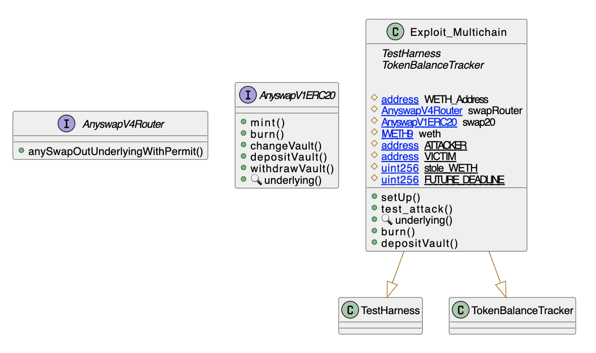

# Multichain Permit Attack
- **Type:** Exploit
- **Network:** Ethereum
- **Total lost**: 308 WETH (~ U$960K)
- **Category:** Data validation
- **Exploited contracts:**
- - [0x6b7a87899490EcE95443e979cA9485CBE7E71522](https://etherscan.io/address/0x6b7a87899490EcE95443e979cA9485CBE7E71522)
- **Attack transactions:**
- - [https://etherscan.io/tx/0xe50ed602bd916fc304d53c4fed236698b71691a95774ff0aeeb74b699c6227f7](https://etherscan.io/tx/https://etherscan.io/tx/0xe50ed602bd916fc304d53c4fed236698b71691a95774ff0aeeb74b699c6227f7)
- **Attacker Addresses**: 
- - [0xfa2731d0bede684993ab1109db7ecf5bf33e8051](https://etherscan.io/address/0xfa2731d0bede684993ab1109db7ecf5bf33e8051)
- **Attack Block:**: 14037237
- **Date:** Jan 19, 2022
- **Reproduce:** `forge test --match-contract Exploit_Multichain -vvv`

## Step-by-step 
1. Craft and deploy a contract so that it passes the requirements.
2. Find a victim that had `permit` the contract to use `WETH`.
2. Call `anySwapOutUnderlyingWithPermit` with your malicious contract and the victim's address.

## Detailed Description

Another attack that relies on an arbitry `token` parameter. Here, Multichain intended the token to be an `Anytoken` (Multichain was previously called AnySwap), which they use to track account balances when doing cross-chain transaction.

The `anySwapOutUnderlyingWithPermit()` method takes a `token` and intends to transfer funds from the token's `underlying` to the contract.

The contract fails to take into account that `WETH` is special: `WETH`'s fallback function triggers its `deposit()` method and returns `true` and does not implement `permit`, so calls to `permit` on `WETH` simply return `true`.

To make matters worst, most of the user of Multichain had given an unlimited `permit`to the contract, so when the contract uses `transferFrom` it can use an arbitrary amount.

``` solidity
    function anySwapOutUnderlyingWithPermit(
        address from,
        address token,
        address to,
        uint amount,
        uint deadline,
        uint8 v,
        bytes32 r,
        bytes32 s,
        uint toChainID
    ) external {
        address _underlying = AnyswapV1ERC20(token).underlying();
        IERC20(_underlying).permit(from, address(this), amount, deadline, v, r, s);
        TransferHelper.safeTransferFrom(_underlying, from, token, amount);
        AnyswapV1ERC20(token).depositVault(amount, from);
        _anySwapOut(from, token, to, amount, toChainID);
    }

    function _anySwapOut(address from, address token, address to, uint amount, uint toChainID) internal {
        AnyswapV1ERC20(token).burn(from, amount);
        emit LogAnySwapOut(token, from, to, amount, cID(), toChainID);
    }
```

Here, the attacker deployed a contract that returned `WETH` as the underlying.

1. `permit` will pass due to the reason outlined above, even with no signature.
2. `transferFrom` will pass if the `victim` allowed Multichain with `permit`.

Then it is just a matter of findings victims.

## Possible mitigations
- Implement a whitelist of allowed tokens.
- Avoid asking users to sign unlimited `permit`s.

## Diagrams and graphs
  
### Class



## Sources and references
- [BlockSec Post](https://blocksecteam.medium.com/the-race-against-time-and-strategy-about-the-anyswap-rescue-and-things-we-have-learnt-4fe086b186ac)
- [Zengo Writeup](https://medium.com/zengo/without-permit-multichains-exploit-explained-8417e8c1639b)
