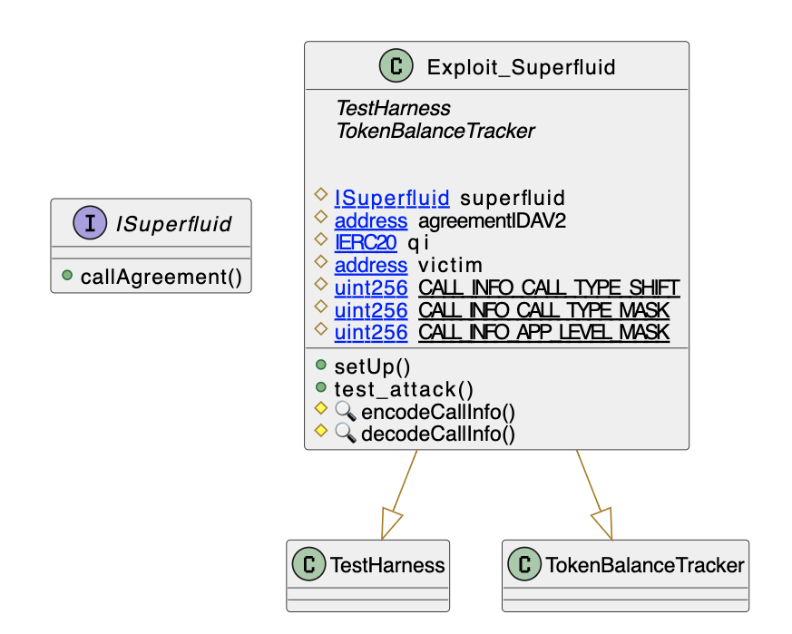

# Superfluid 
- **Type:** Exploit
- **Network:** Polygon
- **Total lost**: 19M QI + 24 WETH + 563K USDC + 11K MATIC + more...
- **Category:** Data validation
- **Exploited contracts:**
- - [0x3E14dC1b13c488a8d5D310918780c983bD5982E7](https://polygonscan.com/address/0x3E14dC1b13c488a8d5D310918780c983bD5982E7)
- **Attack transactions:**
- - [0x396b6ee91216cf6e7c89f0c6044dfc97e84647f5007a658ca899040471ab4d67](https://polygonscan.com/tx/0x396b6ee91216cf6e7c89f0c6044dfc97e84647f5007a658ca899040471ab4d67)
- **Attacker Addresses**: 
- - Contract: [0x32D47ba0aFfC9569298d4598f7Bf8348Ce8DA6D4](https://polygonscan.com/address/0x32D47ba0aFfC9569298d4598f7Bf8348Ce8DA6D4)
- - EOA: [0x1574f7f4c9d3aca2ebce918e5d19d18ae853c090](https://polygonscan.com/address/0x1574f7f4c9d3aca2ebce918e5d19d18ae853c090)
- **Attack Block:**: 24685148
- **Date:** Feb 08, 2022
- **Reproduce:** `forge test --match-contract Exploit_Superfluid -vvv`

## Step-by-step 
1. Craft a `Context` with a forged `msg.sender`
2. Get it authorized via the host contract

## Detailed Description

This attack relies on a problem in the serialization of the `ctx` in the `Host` contract. To understand this, we need to know that `Superfluid.sol` allows composing `agreements` from different `Super Apps` in a single transaction.

To mantain a state throught the different calls to different `Supper Apps`, this `ctx` is set by the `Host` contract. 

Nevertheless, it was possible for the attacker to construct an initial `ctx` that impersonated any user. 

The problem can be seen in the [updateSubscription method](https://github.com/superfluid-finance/protocol-monorepo/blob/d04426e7d6950ae9a27d0c50debb7aab7cac1925/packages/ethereum-contracts/contracts/agreements/InstantDistributionAgreementV1.sol#L466), which uses the `AgreementLibrary` to `authorizeTokenAccess`.

Unfortunately, this method [does not authorize much](https://github.com/superfluid-finance/protocol-monorepo/blob/d04426e7d6950ae9a27d0c50debb7aab7cac1925/packages/ethereum-contracts/contracts/agreements/AgreementLibrary.sol#L39) besides requiring that the call comes from a particular address. 

The attacker can now send a crafted message that set's anyone as the [`publisher`](https://github.com/superfluid-finance/protocol-monorepo/blob/d04426e7d6950ae9a27d0c50debb7aab7cac1925/packages/ethereum-contracts/contracts/agreements/InstantDistributionAgreementV1.sol#L483).

## Possible mitigations
- The [`git blame`](https://github.com/superfluid-finance/protocol-monorepo/blame/48f5951c1fb30127a462cce7b16871c435d66e10/packages/ethereum-contracts/contracts/agreements/AgreementLibrary.sol#L43) of this fix is quite straightforward: the `authorizeTokenAccess` has to actually call the `Host` to make sure this context has been aproved by it.

## Diagrams and graphs
  
### Class

## Sources and references
-[Superfluid Twitter](https://twitter.com/Superfluid_HQ/status/1491045880107048962) 
-[Superfluid Writeup](https://medium.com/superfluid-blog/08-02-22-exploit-post-mortem-15ff9c97cdd) 
-[Rekt Article](https://rekt.news/superfluid-rekt/)
