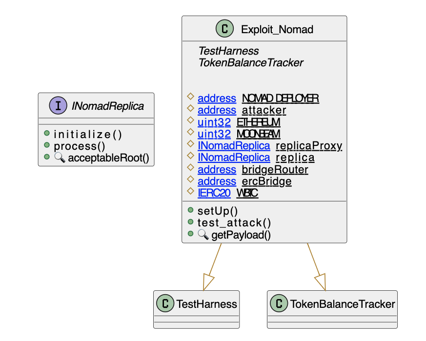
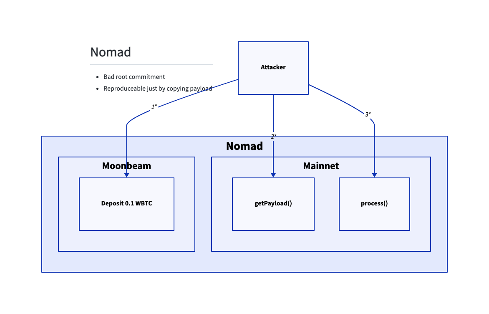

# Nomad Bridge
- **Type:** Exploit
- **Network:** Ethereum / Moonbean
- **Total lost**: ~190MM USD (some returned)
- **Category:**: Bad Data Validation
- **Vulnerable contracts:**
- - [0xb92336759618f55bd0f8313bd843604592e27bd8](https://etherscan.io/address/0xb92336759618f55bd0f8313bd843604592e27bd8), bad initialization at tx [0x53fd92771d2084a9bf39a6477015ef53b7f116c79d98a21be723d06d79024cad](https://etherscan.io/tx/0x53fd92771d2084a9bf39a6477015ef53b7f116c79d98a21be723d06d79024cad)
- **Attack transactions:**
- - Ethereum: [0xa5fe9d044e4f3e5aa5bc4c0709333cd2190cba0f4e7f16bcf73f49f83e4a5460](https://etherscan.io/tx/0xa5fe9d044e4f3e5aa5bc4c0709333cd2190cba0f4e7f16bcf73f49f83e4a5460)
- - Moonbean:[0xcca9299c739a1b538150af007a34aba516b6dade1965e80198be021e3166fe4c](https://moonscan.io/tx/0xcca9299c739a1b538150af007a34aba516b6dade1965e80198be021e3166fe4c)
- **Attacker Addresses**: 
- - EOA: [0xa8c83b1b30291a3a1a118058b5445cc83041cd9d](https://etherscan.io/address/0xa8c83b1b30291a3a1a118058b5445cc83041cd9d)
- **Attack Block:**: 15259101
- **Date:** Aug 1, 2022 
- **Reproduce:** `forge test --match-contract Exploit_Nomad -vvv` 

## Step-by-step 
1. Call `process` with an arbitrary message to the bridge.

## Detailed Description

The root of the problem lies in the `initialize` method. In the [bad initialization tx](https://etherscan.io/tx/0x53fd92771d2084a9bf39a6477015ef53b7f116c79d98a21be723d06d79024cad) the `_commitedRoot` was sent as `0x00`. This causes the `confirmAt[0x00]` value to be `1`.

``` solidity
    function initialize(uint32 _remoteDomain, address _updater, bytes32 _committedRoot, uint256 _optimisticSeconds) public initializer {
        __NomadBase_initialize(_updater);
        // set storage variables
        entered = 1;
        remoteDomain = _remoteDomain;
        committedRoot = _committedRoot;
        // pre-approve the committed root.
        confirmAt[_committedRoot] = 1;
        _setOptimisticTimeout(_optimisticSeconds);
    }
```

So far, there are no obvious issues. The problem is apparent when you check the `process` and `acceptableRoot` methods: sending an arbitrary message results in a call to `acceptableRoot(messages[_messageHash])`. If the message is not in the `messages` map (ie: it has not been processed before), this triggers a call with to `acceptableRoot(0x00)`. 

Because the update set `confirmAt[0x00]` at `1`, this will end up giving `true` for all messages! So anyone can send any message to `process` and get it approved by the contract.

``` solidity
    function process(bytes memory _message) public returns (bool _success) {
        // ensure message was meant for this domain
        bytes29 _m = _message.ref(0);
        require(_m.destination() == localDomain, "!destination");
        // ensure message has been proven
        bytes32 _messageHash = _m.keccak();
        require(acceptableRoot(messages[_messageHash]), "!proven");
        // check re-entrancy guard
        require(entered == 1, "!reentrant");
        entered = 0;
        // update message status as processed
        messages[_messageHash] = LEGACY_STATUS_PROCESSED;
        // call handle function
        IMessageRecipient(_m.recipientAddress()).handle(
            _m.origin(),
            _m.nonce(),
            _m.sender(),
            _m.body().clone()
        );
        // emit process results
        emit Process(_messageHash, true, "");
        // reset re-entrancy guard
        entered = 1;
        // return true
        return true;
    }

    function acceptableRoot(bytes32 _root) public view returns (bool) {
        // this is backwards-compatibility for messages proven/processed
        // under previous versions
        if (_root == LEGACY_STATUS_PROVEN) return true;
        if (_root == LEGACY_STATUS_PROCESSED) return false;

        uint256 _time = confirmAt[_root];
        if (_time == 0) {
            return false;
        }
        return block.timestamp >= _time;
    }

```


## Possible mitigations
- Make sure that initializers uphold invariants. In this case, a `require(_committedRoot != 0)` would have prevented the attack.

## Diagrams and graphs

### Class



### Call graph



## Sources and references
- [samczsun](https://twitter.com/samczsun/status/1554252024723546112)
- [ParadigmEng420](https://twitter.com/paradigmeng420/status/1554249610574450688)
- [0xfoobar](https://twitter.com/0xfoobar/status/1554269062653411334)
- [CertiK](https://twitter.com/CertiKAlert/status/1554305088037978113)
- [Beosin](https://twitter.com/BeosinAlert/status/1554303803218083842)
- [Blocksec](https://twitter.com/BlockSecTeam/status/1554335271964987395)
- [CertiK postmorten](https://www.certik.com/resources/blog/28fMavD63CpZJOKOjb9DX3-nomad-bridge-exploit-incident-analysis)
