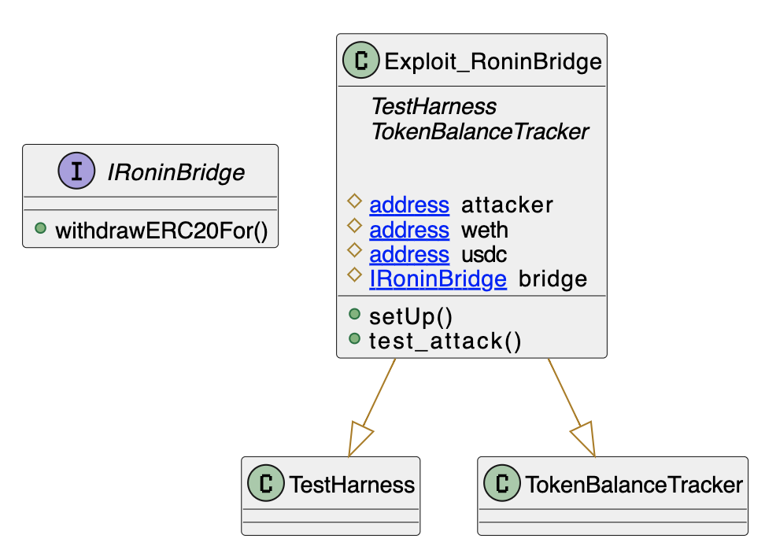
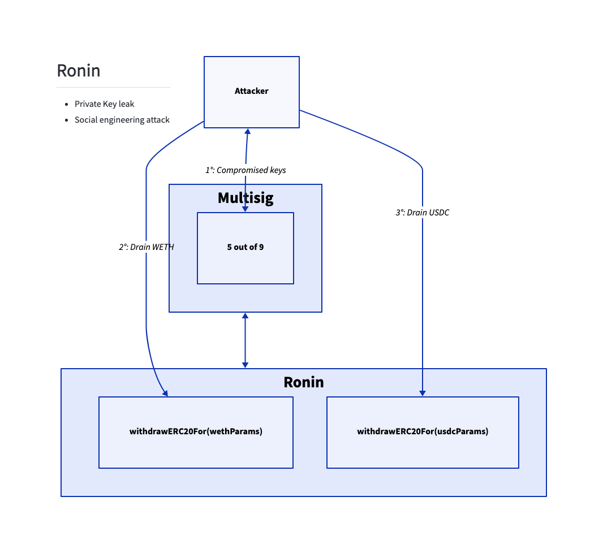

# Ronin Bridge
- **Type:** Exploit
- **Network:** Ethereum
- **Total lost**: ~624MM USD 
- **Category:**: Key Leak
- **Vulnerable contracts:**
- - None
- **Attack transactions:**
- - ETH: [0xc28fad5e8d5e0ce6a2eaf67b6687be5d58113e16be590824d6cfa1a94467d0b7](https://etherscan.io/tx/0xc28fad5e8d5e0ce6a2eaf67b6687be5d58113e16be590824d6cfa1a94467d0b7)
- - USDC: [0xed2c72ef1a552ddaec6dd1f5cddf0b59a8f37f82bdda5257d9c7c37db7bb9b08](https://etherscan.io/tx/0xed2c72ef1a552ddaec6dd1f5cddf0b59a8f37f82bdda5257d9c7c37db7bb9b08)
- **Attacker Addresses**: 
- - [0x098b716b8aaf21512996dc57eb0615e2383e2f96](https://etherscan.io/address/0x098b716b8aaf21512996dc57eb0615e2383e2f96)
- **Attack Block:**: 14442835, 14442840
- **Date:** Mar 23, 2022 
- **Reproduce:** `forge test --match-contract Exploit_RoninBridge -vvv` 

## Step-by-step 
1. Social engineer attack against key holders to get privileged keys
2. Use the privileged keys to drain funds

## Detailed Description

The Ronin Bridge was operated by 9 validators with a threshold of 5 out of the 9. This threshold was misleading though, as 4 validators were operated by Sky Mavis. What is more: in Nov 2021, Axie delegated their validator's signature to Sky Mavis too. This delegation was supposed to be temporary, as Axie was experiencing heavy traffic. Nevertheless, it was never revoked.

As a result, Sky Mavis had 5 signatures. Enough to approve any message. 

The attacker got control of the keys doing a social-engineer attack. Once they had it, the were able to call `withdrawERC` from the bridge without a backing transaction on the other side.

## Possible mitigations
- Multisigs do not matter if in practice several keys are controlled by the same entity. Distribute keys to independent entities to actually enforce that several entities must agree with a transaction before executing it.

## Diagrams and graphs

### Class

### Call graph

## Sources and references
- [Writeup](https://roninblockchain.substack.com/p/community-alert-ronin-validators)
- [Article](https://rekt.news/ronin-rekt/)
