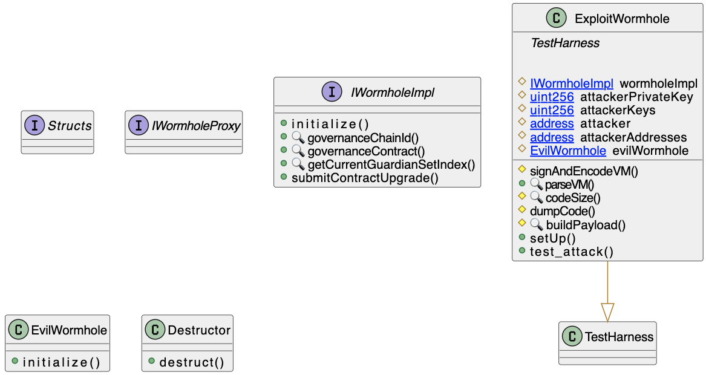

# Wormhole Bridge
- **Type:** Report
- **Network:** Ethereum 
- **Total lost**: 10MM USD (bounty price)
- **Category:** Reinitialization
- **Vulnerable contracts:**
- - Vulnerable implementation: [0x736d2a394f7810c17b3c6fed017d5bc7d60c077d](https://etherscan.io/address/0x736d2a394f7810c17b3c6fed017d5bc7d60c077d)
- - Proxy: [0x98f3c9e6E3fAce36bAAd05FE09d375Ef1464288B](https://etherscan.io/address/0x98f3c9e6E3fAce36bAAd05FE09d375Ef1464288B)
- **Attack transactions:**
- - None
- **Attacker Addresses**: 
- - None
- **Vulnerable Block:**: 13818843
- **Date:** Feb 24, 2022 (report and fix)
- **Reproduce:** `forge test --match-contract Report_Wormhole -vvv`

## Step-by-step 
1. Craft an evil `_bridge` contract
2. Call `initialize` on the implementation contract to set the attacker controlled `guardian`
3. Call `submitContractUpgrade` on the implementation contract, providing attacker controlled signature and payloads, setting the `_bridge` to be your malicious contract

## Detailed Description

Wormhole is a bridge that enables interoperability between blockchains such as Ethereum, Terra, and Binance Smart Chain (BSC).

The bridge implements a proxy standard to be able to upgrade its contract implementation logic.

To do this, it uses a [Universal Upgradable Proxy](https://docs.openzeppelin.com/contracts/4.x/api/proxy#UUPSUpgradeable) pattern.

Proxies have special deployment procedures, triggered by an `initialize` method. This method has access-control mechanisms that will, among other things, set the proxy owner to the first address that calls it.

Unlike Transparent Proxies, in [UUPS](https://eips.ethereum.org/EIPS/eip-1822) the upgrade is handled by the logic implementation, which updates the contract address in the proxy’s storage space. This is typically done with the proxy contract calling `upgradeToAndCall`, through a `DELEGATECALL`, which will execute the implementation in the context of the proxy itself.

The Wormhole proxy [implementation contract](https://etherscan.io/address/0x736d2a394f7810c17b3c6fed017d5bc7d60c077d#code) was left uninitialized after a bugfix had reverted the original initialization.

When a proxy is not properly initialized, there are serious security implications. The Wormhole implementation upgrade procedure (`submitContractUpgrade`) has an additional security mechanism, being protected by a multi-sig held by its Guardians. These signatures are set by the `initialize` method. This method is protected by a lock, ensuring that it can only be called once.

``` solidity
    function initialize(address[] memory initialGuardians, uint16 chainId, uint16 governanceChainId, bytes32 governanceContract) initializer public {
        require(initialGuardians.length > 0, "no guardians specified");

        Structs.GuardianSet memory initialGuardianSet = Structs.GuardianSet({
            keys : initialGuardians,
            expirationTime : 0
        });

        storeGuardianSet(initialGuardianSet, 0);
        // initial guardian set index is 0, which is the default value of the storage slot anyways

        setChainId(chainId);

        setGovernanceChainId(governanceChainId);
        setGovernanceContract(governanceContract);
    }

    modifier initializer() {
        address implementation = ERC1967Upgrade._getImplementation();

        require(
            !isInitialized(implementation),
            "already initialized"
        );

        setInitialized(implementation);

        _;
    }
```
Not being initialized, anyone can trigger the `initialize` method, providing their own set of authorized guardians.
Next, the new owner can call `submitContractUpgrade` providing signatures and a contract of choice to replace the logic implementation.

``` solidity
    function submitContractUpgrade(bytes memory _vm) public {
        Structs.VM memory vm = parseVM(_vm);

        (bool isValid, string memory reason) = verifyGovernanceVM(vm);
        require(isValid, reason);

        GovernanceStructs.ContractUpgrade memory upgrade = parseContractUpgrade(vm.payload);

        require(upgrade.module == module, "Invalid Module");
        require(upgrade.chain == chainId(), "Invalid Chain");

        setGovernanceActionConsumed(vm.hash);

        upgradeImplementation(upgrade.newContract);
    }
```
``` solidity
    function upgradeImplementation(address newImplementation) internal {
        address currentImplementation = _getImplementation();

        _upgradeTo(newImplementation);

        // Call initialize function of the new implementation
        (bool success, bytes memory reason) = newImplementation.delegatecall(abi.encodeWithSignature("initialize()"));

        require(success, string(reason));

        emit ContractUpgraded(currentImplementation, newImplementation);
    }
```

An attacker could have easily exploited this by initializing the implementation, then submitting a contract to upgrade.

Now notice that it is the **implementation contract** that was not initialized, not the **proxy contract**. This is a plot twist in the story. Because the call will not go through the proxy, an attacker cannot change its storage. Strategies like setting a malicious implementation to send fake messages to its users, for instance, would not work. So one needs to be creative: [hold the implementation contract to ransome](https://portswigger.net/daily-swig/blockchain-bridge-wormhole-pays-record-10m-bug-bounty-reward). In this scenario an attacker could take over the implementation contract, threatening to destroy it, if not paid a requested amount.

Upgrading the implementation with a contract issuing `SELFDESTRUCT` would brick the proxy's logic, locking the Wormhole bridge funds forever.

## Possible mitigations
- Be careful when implementing proxy upgradability
- Make sure to implement secure authentication and authorization schemes
- Test deploy conditions, like `contract should be initialized` and `should not be able to reinitialize contract`

## Diagrams and graphs

### Class



## Sources and references
- [Writeup](https://medium.com/immunefi/wormhole-uninitialized-proxy-bugfix-review-90250c41a43a)


