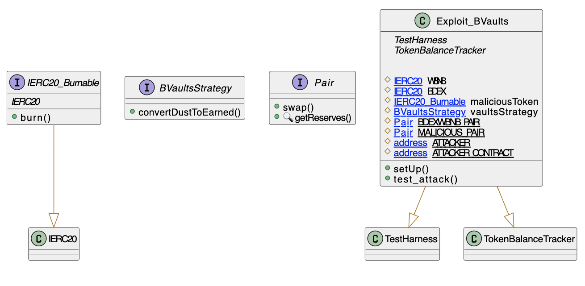
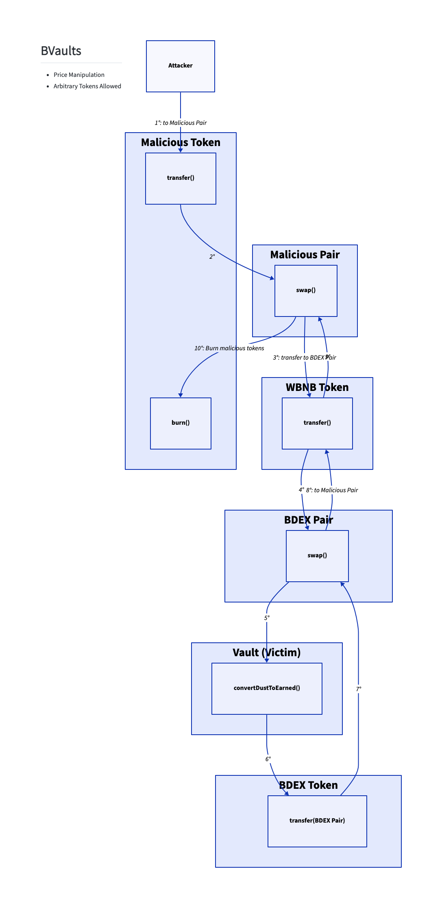

# BVaults
- **Type:** Exploit
- **Network:** Binance Smart Chain 
- **Total lost**: 35K
- **Category:** Price manipulation
- **Vulnerable contracts:**
- - [0xB2B1DC3204ee8899d6575F419e72B53E370F6B20](https://bscscan.com/address/0xB2B1DC3204ee8899d6575F419e72B53E370F6B20)
- **Attack transactions:**
- - [0xe7b7c974e51d8bca3617f927f86bf907a25991fe654f457991cbf656b190fe94](https://bscscan.com/tx/0xe7b7c974e51d8bca3617f927f86bf907a25991fe654f457991cbf656b190fe94)
- **Attacker Addresses**: 
- - EOA: [0x5bfaa396c6fb7278024c6d7230b17d97ce8ab62d](https://bscscan.com/address/0x5bfaa396c6fb7278024c6d7230b17d97ce8ab62d)
- **Attack Block:**: 22629432
- **Date:** Oct 30, 2022 
- **Reproduce:** `forge test --match-contract Exploit_BVaults -vvv`

## Step-by-step 
1. Create a malicious token and pair
2. Inflate its price
3. Call convertDustToEarned
4. Swap again
5. Cashout and repeat

## Detailed Description

This attack relies on the fack that BVault provided a `convertDustToEarned` method that would swap all of the tokens in the pool to "earned" tokens.

Unfortunately, it did not do any kind of price check or use any kind of smoothing of the price curve. This makes it vulnerable to price inflation: the attacker created a malicious token and pair, inflated the price of the token in the pool and then used it to gain `earnedTokens`.

``` solidity
    function convertDustToEarned() public whenNotPaused {
        require(isAutoComp, "!isAutoComp");

        // Converts dust tokens into earned tokens, which will be reinvested on the next earn().

        // Converts token0 dust (if any) to earned tokens
        uint256 _token0Amt = IERC20(token0Address).balanceOf(address(this));
        if (token0Address != earnedAddress && _token0Amt > 0) {
            _vswapSwapToken(token0Address, earnedAddress, _token0Amt);
        }

        // Converts token1 dust (if any) to earned tokens
        uint256 _token1Amt = IERC20(token1Address).balanceOf(address(this));
        if (token1Address != earnedAddress && _token1Amt > 0) {
            _vswapSwapToken(token1Address, earnedAddress, _token1Amt);
        }
    }

    function _vswapSwapToken(address _inputToken, address _outputToken, uint256 _amount) internal {
        IERC20(_inputToken).safeIncreaseAllowance(vswapRouterAddress, _amount);
        IValueLiquidRouter(vswapRouterAddress).swapExactTokensForTokens(_inputToken, _outputToken, _amount, 1, vswapPaths[_inputToken][_outputToken], address(this), now.add(1800));
    }
```

## Possible mitigations
- Either introduce an oracle to get a second-source of truth for prices or use time-weighted-average to smooth the curve.

## Diagrams and graphs

### Class



### Call graph



## Sources and references
- [Beosin Alert's Twitter](https://twitter.com/BeosinAlert/status/1588579143830343683)
- [Source Code](https://bscscan.com/address/0xb2b1dc3204ee8899d6575f419e72b53e370f6b20#code)
