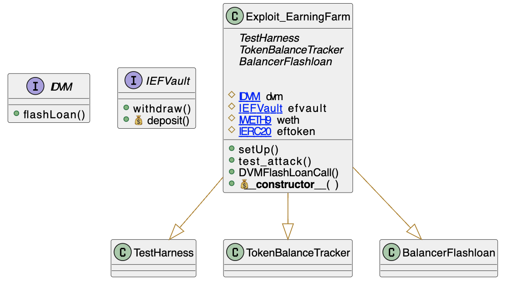

# Earning Farm
- **Type:** Exploit
- **Network:** Ethereum 
- **Total lost**: 200 ETH (750 ETH originally targetted, 550 returned by MEV frontrunning bot)
- **Category:** Flashloan attack
- **Vulnerable contracts:**
- - [0xe39fd820b58f83205db1d9225f28105971c3d309](https://etherscan.io/address/0xe39fd820b58f83205db1d9225f28105971c3d309)
- **Attack transactions:**
- - [0x160c5950a01b88953648ba90ec0a29b0c5383e055d35a7835d905c53a3dda01e](https://etherscan.io/tx/0x160c5950a01b88953648ba90ec0a29b0c5383e055d35a7835d905c53a3dda01e)
- **Attacker Addresses**: 
- - EOA: [0xdf31f4c8dc9548eb4c416af26dc396a25fde4d5f](https://etherscan.io/address/0xdf31f4c8dc9548eb4c416af26dc396a25fde4d5f)
- - Contract: [0x983dfBa1c0724786598Af0E63a9a6f94aAbd24A1](https://etherscan.io/address/0x983dfBa1c0724786598Af0E63a9a6f94aAbd24A1)
- **Attack Block:**: 15746342 
- **Date:** Oct 14, 2022 
- **Reproduce:** `forge test --match-contract Exploit_EarningFarm -vvv`

## Step-by-step 
1. Deposit a small amount into the vulnerable contract
2. Request a Flash Loan from Balance for the contract
3. Withdraw your small amount and get **a lot** more

## Detailed Description

The Earning Farm contract has a `withdraw` method that uses flash loans to pay debt accrued in the AAVE protocol. The contract is probably intended as a leveraged pool (flashloans that are used to swap assets), althought is 

We can start the flow by looking at the public `withdraw` method and noting where it makes the call to `flashLoan`. 

``` solidity
 function withdraw(uint256 _amount) public nonReentrant{
    require(IERC20(ef_token).balanceOf(msg.sender) >= _amount, "not enough balance");
    if (is_paused){
      uint256 to_send = address(this).balance.safeMul(_amount).safeDiv(IERC20(ef_token).totalSupply());
      (bool status, ) = msg.sender.call.value(to_send)("");
      require(status, "transfer eth failed");
      TokenInterfaceERC20(ef_token).destroyTokens(msg.sender, _amount);
      return;
    }

    _earnReward();

    uint256 loan_amount = getDebt().safeMul(_amount).safeDiv(IERC20(ef_token).totalSupply());
    
    address[] memory tokens = new address[](1);
    uint256[] memory amounts = new uint256[](1);
    bytes memory userData = "0x2";
    tokens[0] = weth;
    amounts[0] = loan_amount;
    //uint256 user_eth_before = msg.sender.balance;
    IBalancer(balancer).flashLoan(address(this), tokens, amounts, userData);

    uint256 to_send = address(this).balance;
    (bool status, ) = msg.sender.call.value(to_send)("");
    require(status, "transfer eth failed");

    TokenInterfaceERC20(ef_token).destroyTokens(msg.sender, _amount);
    emit CFFWithdraw(msg.sender, to_send, _amount, getVirtualPrice());
  }
```

See that `0x02` is sent as `userData`, which makes the callback `receiveFlashLoan` (which will be called by the loaner) go to the `_withdraw` method.

```solidity
    function receiveFlashLoan(
        IERC20[] memory tokens,
        uint256[] memory amounts,
        uint256[] memory feeAmounts,
        bytes memory userData
    ) public payable {
        require(msg.sender == balancer, "only flashloan vault"); 
        uint256 loan_amount = amounts[0];
        uint256 fee_amount = feeAmounts[0];

        if (keccak256(userData) == keccak256("0x1")){
          _deposit(loan_amount, fee_amount);
        }
        if (keccak256(userData) == keccak256("0x2")){
          _withdraw(loan_amount, fee_amount);
        }
    }
```

In the `_withdraw` method, it repays some of the debt to AAVE and repays the flashloaner (see: `weth.call.value...`). 

``` solidity
  //1. rapay aave with flashloaned amount,    mx
  //2. withdraw steth with current ltv,  x
  //3. change all steths to eths,    x         
  //4. repay flashloan.   pay amx, left x-amx eth
  function _withdraw(uint256 amount, uint256 fee_amount) internal{
    uint256 steth_amount = amount.safeMul(IERC20(asteth).balanceOf(address(this))).safeDiv(getDebt());
    if (IERC20(weth).allowance(address(this), aave) != 0) {IERC20(weth).safeApprove(aave, 0);}
    IERC20(weth).safeApprove(aave, amount);

    IAAVE(aave).repay(weth, amount, 2, address(this));
    IAAVE(aave).withdraw(lido, steth_amount, address(this));

    if (IERC20(lido).allowance(address(this), curve_pool) != 0) {IERC20(lido).safeApprove(curve_pool, 0);}
    IERC20(lido).safeApprove(curve_pool, steth_amount);
    ICurve(curve_pool).exchange(1, 0, steth_amount, 0);

    (bool status, ) = weth.call.value(amount.safeAdd(fee_amount))("");
    require(status, "transfer eth failed");
    IERC20(weth).safeTransfer(balancer, amount.safeAdd(fee_amount));
  }
```


When it finishes this call, it goes back to the `withdraw()` method, which transfer all the balance in the contract to the sender. 

So, conceptually:
1. User requests a withdrawal backed by EF Token
2. Contract takes a flash loan of `debt*(withdrawal_amount / total_supply)`
3. Contract uses flashloan from Balancer to pay AAVE in `weth`
4. Contract withdraws `steth` from AAVE (it borrowed `weth` and now has paid it back, so it can withdraw a portion of its collateral)
5. Contract exchanges `steth` for `eth` using `curve_pool`
6. Contract pays back flashloan
7. Contract pays users its whole `balance` in ETH (note: it assuments contract holds exactly `steth_amount` in `ETH`)

This scheme works as long as the initial withdrawal is checked against the `EF Token`, which is the first check in the `withdraw()` method.


``` solidity
    require(IERC20(ef_token).balanceOf(msg.sender) >= _amount, "not enough balance");
```

This limits the `_amount` the sender can `withdraw`, which transitively limits the `steth_amount` the contract will exchange for `ETH` in the call to the `curve_pool`.

But what if an attacker totally bypasses this check and is able to arbitrarily add balance to the pool?

To do this, an attacker requests a flash loan from Balancer specifying the contract as the receiver? In that case, our call starts from the `receiveFlashLoan` method, which will call withdrawal if passed `0x02` as the user data. Note that `amount` is now unchecked, and the contract will performs the swap with this arbitrary amount, receiving finally an arbitrary amount of `ETH`. This `amount` is only limited by the contract's actual reserves, denominated in `stETH`.


So an attacker:
1. Deposits some amount into the contract to pass this require:

``` solidity
    require(IERC20(ef_token).balanceOf(msg.sender) >= _amount, "not enough balance");
```

2. Triggers a Flashloan from Balance directly into the contract, which will repay the debt, recover the collateral and exchange it for ETH into the contract
3. Call `withdraw` with the amount they deposited (or less), which will transfer **all** of the balance from the contract into the attackers address.

## Diagrams and graphs

### Class




## Possible mitigations
There are several things that could be improved here.
1. Balance's Flashloan do not include the `msg.sender` in their callbacks, so it was impossible for Earning Farm to check that they had initiated the call. This is a problem with Balance itself as it does not conform to [EIP-3156](https://eips.ethereum.org/EIPS/eip-3156)
2. To migitate this risk, Earning Farm could the balances before and after the flashloan in `withdraw` so they correlate with the amount of tokens the user has. Curiously, there's a commented line in the `withdraw()` method which hints that something like this was being implemented or at least thought of, although this is speculation.

``` solidity
    //uint256 user_eth_before = msg.sender.balance;
```

3. (2) does not completely solve the problem, but at least makes it non-profitable to an attacker. It still is possible for an attacker to force the contract to recover collateral. 

## Sources and references
- [Supremacy CA Twitter Thread](https://twitter.com/Supremacy_CA/status/1581012823701786624)
- [Source Code](https://etherscan.io/address/0xe39fd820b58f83205db1d9225f28105971c3d309#code)
