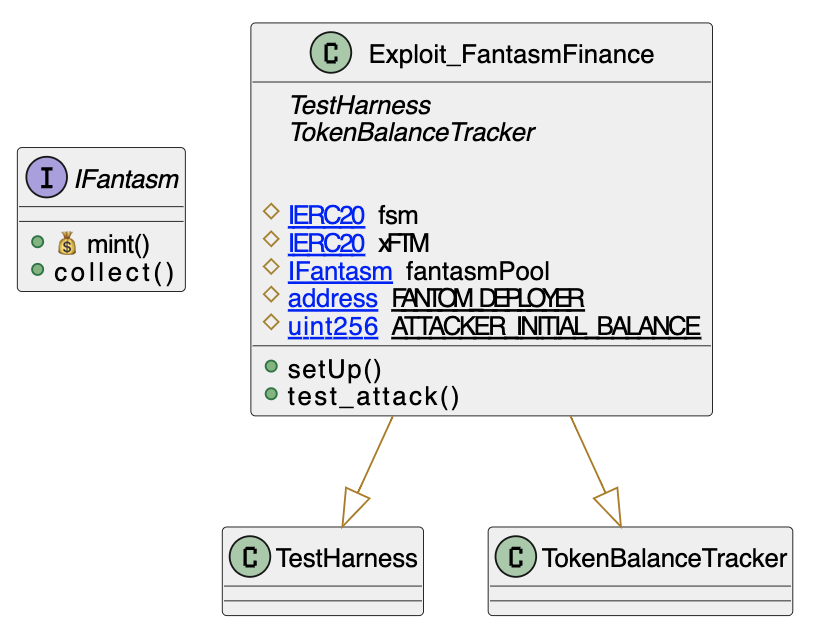

# Fantasm Finance
- **Type:** Exploit
- **Network:** Fantom 
- **Total lost**: ~$2.62MM USD
- **Category:** Bad Data Validation
- **Vulnerable contracts:**
- - [0x880672ab1d46d987e5d663fc7476cd8df3c9f937](https://ftmscan.com/address/0x880672ab1d46d987e5d663fc7476cd8df3c9f937)
- **Attack transactions:**
- - [0x0c850bd8b8a8f4eb3f3a0298201499f794e0bfa772f620d862b13f0a44eadb82](https://ftmscan.com/tx/0x0c850bd8b8a8f4eb3f3a0298201499f794e0bfa772f620d862b13f0a44eadb82)
- **Attacker Addresses**: 
- - EOA: [0x47091e015b294b935babda2d28ad44e3ab07ae8d](https://ftmscan.com/address/0x47091e015b294b935babda2d28ad44e3ab07ae8d)
- - Contract: [0x944b58c9b3b49487005cead0ac5d71c857749e3e](https://ftmscan.com/address/0x944b58c9b3b49487005cead0ac5d71c857749e3e)
- **Attack Block:**: 32968740 
- **Date:** Mar 09, 2022 
- **Reproduce:** `forge test --match-contract Exploit_FantasmFinance -vvv`

## Step-by-step 
1. Call `mint` without providing any backing for your mint
2. Profit

## Detailed Description

As most tokens, you can `mint` Fantasm on some conditions. Particularly, Fantasm wanted to ask for some native tokens `_ftmIn` and some amount of an extra token `_fantasmIn` to mint some `XFTM`.

So, in short, you need to give `FTM` (native token) and `FXM` (non-native, is burned) to mint some `XFTM`.

The problem is that the `mint` function never checks for the amount of `FMT` deposited, allowing the attacker to mint with only `FXM`.

```solidity
    function mint(uint256 _fantasmIn, uint256 _minXftmOut) external payable nonReentrant {
        require(!mintPaused, "Pool::mint: Minting is paused");
        uint256 _ftmIn = msg.value;
        address _minter = msg.sender;

        // This is  supposed to mint. There are three parameters:
        // 1. Native token passed `_ftmIn`
        // 2. _fantasmIn an amount
        // 3.`_minXftmOut` slippage protection
        // What you say here is "Giving you _ftmIn native, I want at least minXftmOut, and I will put _fantasmIn as collateral"

        (uint256 _xftmOut, , uint256 _minFantasmIn, uint256 _ftmFee) = calcMint(_ftmIn, _fantasmIn);
        require(_minXftmOut <= _xftmOut, "Pool::mint: slippage");
        require(_minFantasmIn <= _fantasmIn, "Pool::mint: Not enough Fantasm input");
        require(maxXftmSupply >= xftm.totalSupply() + _xftmOut, "Pool::mint: > Xftm supply limit");

        WethUtils.wrap(_ftmIn);
        userInfo[_minter].lastAction = block.number;

        if (_xftmOut > 0) {
            userInfo[_minter].xftmBalance = userInfo[_minter].xftmBalance + _xftmOut;
            unclaimedXftm = unclaimedXftm + _xftmOut;
        }

        if (_minFantasmIn > 0) {
            fantasm.safeTransferFrom(_minter, address(this), _minFantasmIn);
            fantasm.burn(_minFantasmIn);
        }

        if (_ftmFee > 0) {
            WethUtils.transfer(feeReserve, _ftmFee);
        }
        
        emit Mint(_minter, _xftmOut, _ftmIn, _fantasmIn, _ftmFee);
    }

```

## Possible mitigations

1. The obvious recommendation here is "check that counterpart token is received", but...
2. ... this can be covered by a test. Make sure to have **negative testing** as part of the suite of your contract, with tests that check that "should not mint XFTM without backing native token"

## Diagrams and graphs

### Class



## Sources and references
- [Fastm Finance Twitter](https://twitter.com/fantasm_finance/status/1501569232881995785)
- [Certik's Writeup](https://www.certik.com/resources/blog/5p92144WQ44Ytm1AL4Jt9X-fantasm-finance)
- [Coindesk Article](https://www.coindesk.com/tech/2022/03/10/fantom-based-algo-protocol-fantasm-exploited-for-26m/) 
- [Source Code](https://ftmscan.com/address/0x880672ab1d46d987e5d663fc7476cd8df3c9f937#code#F11#L151)
