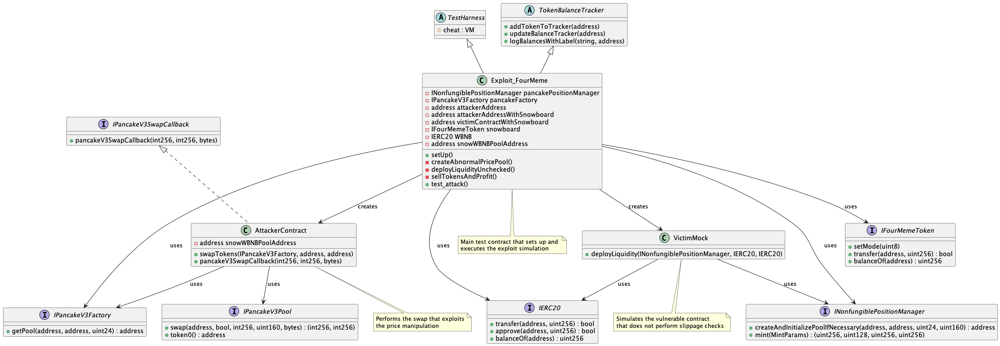

# Four Meme Pool Price Manipulation
- **Type:** Exploit
- **Network:** Binance Smart Chain
- **Total lost**: 14k USD with SNOWBOARD, total estimated 183k
- **Category:** Price Manipulation
- **Exploited contracts:**
- - FourMeme Liquidity Provider: https://bscscan.com/address/0x5c952063c7fc8610ffdb798152d69f0b9550762b
- **Attack blocks and transactions:** 

* * [46555725](https://bscscan.com/tx/0x4235b006b94a79219181623a173a8a6aadacabd01d6619146ffd6fbcbb206dff) (Malicious pool initialized)
* * [46555731](https://bscscan.com/tx/0xe0daa3bf68c1a714f255294bd829ae800a381624417ed4b474b415b9d2efeeb5) (Liquidity added)
* * [46555732](https://bscscan.com/tx/0x2902f93a0e0e32893b6d5c907ee7bb5dabc459093efa6dbc6e6ba49f85c27f61) (Tokens sold)

- **Date:** Feb 11, 2025
- **Reproduce:** `forge test --match-contract Exploit_FourMeme -vvv`

## Step-by-step 
1. Call the PancakeSwap V3 position manager to initialize the SNOWBOARD/WBNB liquidity pool with an unfavourable price.
2. Wait for the victim to deploy liquidity without checking minimum desired amounts.
3. Sell the SNOWBOARD meme coins to drain as most WBNB as possible.

## Detailed Description

[four.meme]() is a memecoin launchpad on the BNB Smart Chain, similar to [pump.fun](). This platform operates in three main steps:

1. **Creation**: Users customize the name, logo, description, and optional social accounts to generate a new memecoin.
2. **Trading**: Other users can trade the memecoin directly on the platform.
3. **Migration**: Once the memecoin's market value reaches a predefined threshold (24 BNB on four.meme), it is migrated to a decentralized exchange (DEX) such as PancakeSwap.

Now, let's dive into the technical details of each stage.

### What Happened?

The core issue originates from four.meme's contract [0x5c95](https://bscscan.com/address/0x5c952063c7fc8610ffdb798152d69f0b9550762b). Specifically, when adding liquidity to the pool via the `mint` function in the Pancake V3 Position Manager, the contract **failed to provide the `amount0Min` and `amount1Min` values**. These values define the minimum required token amounts for a successful liquidity provision, protecting against unfavorable price fluctuations. If the actual required amounts fall below these minimums, the transaction reverts to prevent unintended losses due to slippage. However, due to this oversight:

1. The attacker **preemptively deployed a SNOWBOARD/WBNB pool with an artificially high token price** by calling the [`createAndInitializePoolIfNecessary`](https://docs.uniswap.org/contracts/v3/reference/periphery/base/PoolInitializer) function.
2. When the vulnerable contract attempted to create a Pancake V3 pool for the token, it **failed to verify the pool’s state or price if an existing pool was already deployed**. As a result, the platform unknowingly added liquidity to the attacker’s malicious pool at a manipulated price.
3. Finally, the attacker **sold the tokens acquired from the platform’s internal pool at a lower price, making a profit**. Notably, no MEV bot detected this exploitation, as the initial distribution of SNOWBOARD tokens was limited to a few wallets.

## Possible mitigations

To mitigate this attack, [four.meme]() should have set appropriate `amount0Min` and `amount1Min` values when adding liquidity to the pool.

## Diagrams and graphs

### Entity and class diagram

## Sources and references
- [FourMeme Incident Analysis by PANews](https://followin.io/en/feed/16280900)
- [TenArmor Security Alert on X](https://x.com/TenArmorAlert/status/1889515007404286019)