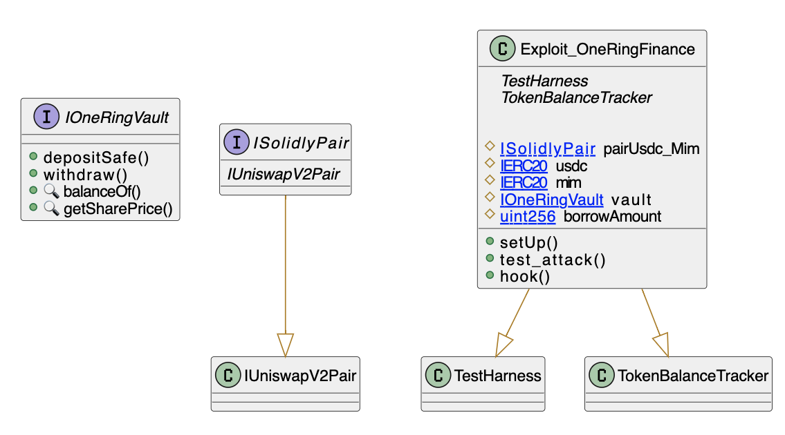

# One Ring Finance
- **Type:** Exploit
- **Network:** Fantom 
- **Total lost:** ~$1.55MM USDC
- **Category:** Price Manipulation
- **Vulnerable contracts:**
- - [0x66a13cd7ea0ba9eb4c16d9951f410008f7be3a10](https://ftmscan.com/address/0x66a13cd7ea0ba9eb4c16d9951f410008f7be3a10)
- **Attack transactions:**
- - [0xca8dd33850e29cf138c8382e17a19e77d7331b57c7a8451648788bbb26a70145](https://ftmscan.com/tx/0xca8dd33850e29cf138c8382e17a19e77d7331b57c7a8451648788bbb26a70145)
- **Attacker Addresses**: 
- - EOA: [0x12efed3512ea7b76f79bcde4a387216c7bce905e](https://ftmscan.com/address/0x12efed3512ea7b76f79bcde4a387216c7bce905e)
- - Contract: [0x6a6d593ed7458b8213fa71f1adc4a9e5fd0b5a58](https://ftmscan.com/address/0x6a6d593ed7458b8213fa71f1adc4a9e5fd0b5a58)
- **Attack Block:**: 34041500 
- **Date:** Mar 21, 2022
- **Reproduce:** `forge test --match-contract Exploit_OneRingFinance -vvv`

## Step-by-step 
1. Flashloan some USDC
2. Deposit it to mint shares
3. Withdraw the shares for USDC
4. Repay loand and transfer profit

## Detailed Description

One Ring Finance used the amount of reserves held in the vault as a price gauge. The attacker can manipulate the price by changhing the amount of reserves in the contract.

Both the `deposit` and `withdraw` methods use:

``` solidity
        uint256 _sharePrice = getSharePrice();
```

To calculate how many shares the user must receive. To exploit this, the attacker deposited USDC into the contract, which drove the price of the shares up, and then immediatly sold them. 


## Possible mitigations

1. Use Time-Weighted price feeds or other reliable oracles to get the price of commodities instead of relying on a metric that can be manipulated with flash loans.
2. Another strategy is to implement `slippage`, so the price of each share increase the more you buy.

## Diagrams and graphs

### Class



## Sources and references
- [Writeup]( https://medium.com/oneringfinance/onering-finance-exploit-post-mortem-after-oshare-hack-602a529db99b)
