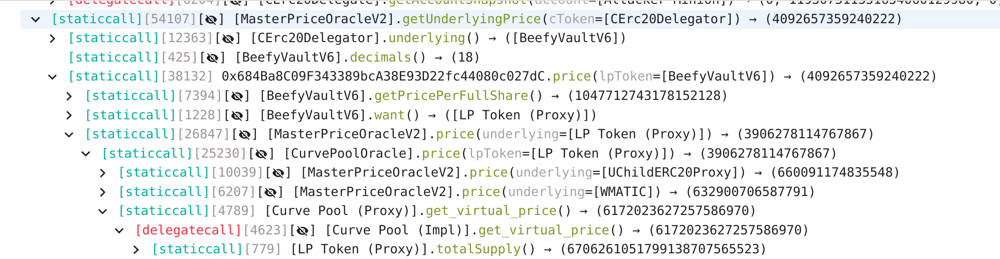

# Curve Pool Oracle
- **Type:** Exploit
- **Network:** Polygon
- **Total lost**: 138 ETH
- **Category:** Reentrancy
- **Exploited contracts:**
- - [0x3dC7E6FF0fB79770FA6FB05d1ea4deACCe823943](https://polygonscan.com/address/0x3dC7E6FF0fB79770FA6FB05d1ea4deACCe823943)
- **Attack transactions:**
- - [0xb8efe839da0c89daa763f39f30577dc21937ae351c6f99336a0017e63d387558](https://polygonscan.com/tx/0xb8efe839da0c89daa763f39f30577dc21937ae351c6f99336a0017e63d387558)
- **Attacker Addresses**:
- - EOA: [0x8ca72f46056d85db271dd305f6944f32a9870ff0](https://etherscan.io/address/0x8ca72f46056d85db271dd305f6944f32a9870ff0)
- - Contract: [0xEb4c67E5BE040068FA477a539341d6aeF081E4Eb](https://polygonscan.com/address/0xEb4c67E5BE040068FA477a539341d6aeF081E4Eb)
- **Attack Block:**:  34716801
- **Date:** Nov 23, 2022
- **Reproduce:** `forge test --match-contract Exploit_QiProtocol_Through_Curve -vvv`

## Step-by-step 
1. Take a flashloan 
2. Add a lot of liquidity to an eth/{something} pool to get LP tokens
3. Remove liquidity triggering fallback when receiving ETH
4. Request a loan from a system using `get_virtual_price` as a price oracle for LP tokens
5. Loan will be given taking a higher-than-real price for LP tokens
6. Repay flashloan

## Detailed Description

Understanding this attacks needs some familiarity with AMMs and how crypto system compose with each other. 

We will start by reviewing [Curve's Stable Swaps](https://curve.fi/files/stableswap-paper.pdf). There's no need to go deep into the math, we can just understand that is is an AMM that is optimized for trades between assets that are really close in price (different from constant product AMMs).

The graph below should give us a fairly good intuition of how the curve in an stableswap look like:


Stableswaps keep a value `D` as the swap-invariant (like constant product keeps `k`). Just like in constant product, this is a semi-invariant in in practice as it will increase due to fees.

Now, we must understand some particularities of Curve before moving forward. We probably can't do it better than the folks at [ChainSecurity](https://chainsecurity.com/heartbreaks-curve-lp-oracles/) have already done, so we really recommend you  go and read the blog post. Let's do a **very** condensed summary just in case you don't have time to read the full story today:

### A primer on Curve Pool
Curve Pools have a `get_virtual_price` that returns the prices of LP tokens (calculated as `D / total_lp_token_supply ~= total_underlying_supply / total_lp_token_supply`). 

When you `burn` your LP tokens, this code is executed:

``` solidity
// _amount is the amount of lp tokens burn
// amount[i] is the total amount of each token
CurveToken(lp_token).burnFrom(msg.sender, _amount)
for i in range(N_COINS):
    value: uint256 = amounts[i] * _amount / total_supply
    if i == 0:
        raw_call(msg.sender, b"", value=value)
    else:
    assert ERC20(self.coins[1]).transfer(msg.sender, value)
```

Note that if `i == 0` the `value` is sent natively. This means `msg.sender` is suddenly executed. At this point, the contract has burned the LP tokens but has only sent part of the underlyings. If you remember, `get_virtual_price` was `total_underlying_supply / total_lp_token_supply`: this number is now off, as only a part of the `total_underlying_supply` has been sent while all of the corresponding `total_lp_token_supply` has been burned.

If an attacker finds a protocol that uses `get_virtual_price` as a price oracle for LP tokens, they could be exploited.

Unfortunately, this is exactly what QiDao and Market XYZ did. For the purposes of this reproduction, we are gonna concentrate on QiDAO but the concept for Market XYZ is the same.

At this point, you only need to know that QiDAO is a lending platform which used [MasterPriceOracle](https://polygonscan.com/address/0x71585E806402473Ff25eda3e2C3C17168767858a) to get the prices for their collateralized borrows. Unfortunately, this oracle used `get_virtual_price`, which we now know how to exploit.



## Possible mitigations
- Ensure that the tokens addresses provided match the addresses from the targeted pool or check if they are whitelisted.
- Use a reentrancy mutex if arbitrary tokens are meant to be handled.
- Review the checks-effects-interactions pattern and evaluate the steps at which tokens flow in and out the contract.

## Diagrams and graphs

## Sources and references
- [Curve LP Manipulation Post Mortem](https://chainsecurity.com/curve-lp-oracle-manipulation-post-mortem/)
- [Beosin Tweet](https://twitter.com/BeosinAlert/status/1584551399941365763)
