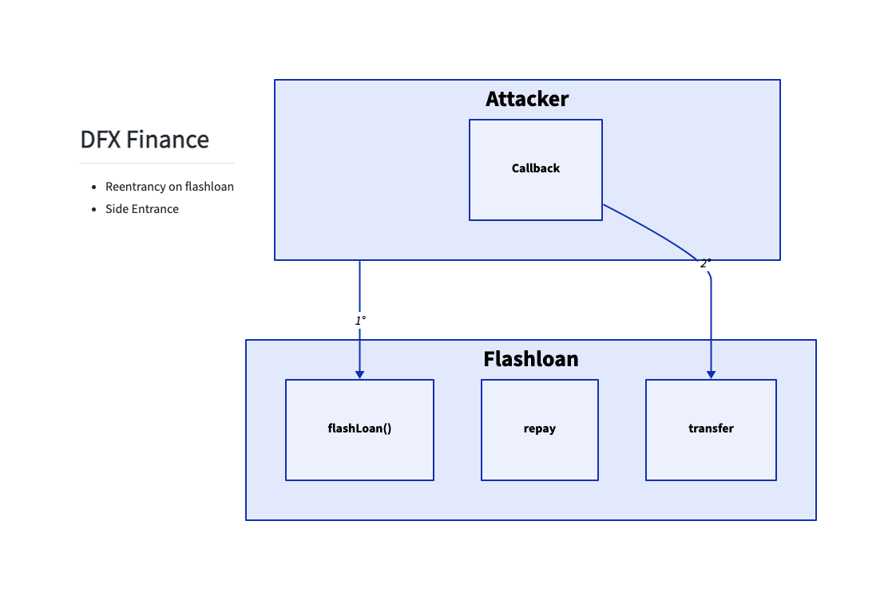
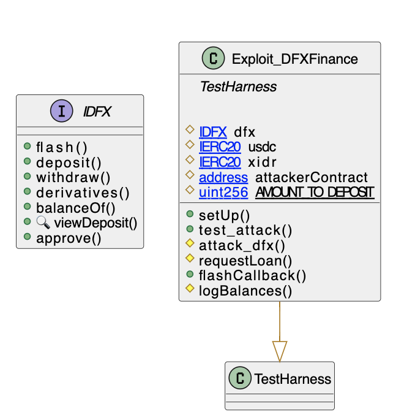

# DFX Finance
- **Type:** Exploit
- **Network:** Mainnet
- **Total lost**: ~$6MM in various tokens
- **Category:** Reentrancy
- **Exploited contracts:**
- - DFX: https://etherscan.io/address/0x46161158b1947D9149E066d6d31AF1283b2d377C
- **Attack transactions:**
- - First Attack Tx: https://etherscan.io/tx/0x390def749b71f516d8bf4329a4cb07bb3568a3627c25e607556621182a17f1f9
- - Subsequent Attack Tx: https://etherscan.io/tx/0x6bfd9e286e37061ed279e4f139fbc03c8bd707a2cdd15f7260549052cbba79b7
- **Attack Block:**: 15941674 
- **Date:** Nov 10, 2022
- **Reproduce:** `forge test --match-contract Exploit_DFXFinance -vvv`

## Step-by-step 
1. Request a Flashloan
2. Deposit the received amount in the loan callback

## Detailed Description
As there is no reentrancy protection in the flashloan function and token balances are checked to determine if the loan was paid back, the attacker simply asked for a loan and deposited the amount requested to mint shares inside the loan callback. 

``` solidity
    function flash(
        address recipient,
        uint256 amount0,
        uint256 amount1,
        bytes calldata data
    ) external transactable noDelegateCall isNotEmergency {
        ...
        ...
        uint256 balance0After = IERC20(derivatives[0]).balanceOf(address(this));
        uint256 balance1After = IERC20(derivatives[1]).balanceOf(address(this));

        require(balance0Before.add(fee0) <= balance0After, 'Curve/insufficient-token0-returned');
        require(balance1Before.add(fee1) <= balance1After, 'Curve/insufficient-token1-returned');
    }
```

Because the balance checked after executing the flashloan callback was satisfied, the loan succeded. Then, the attacker simply called withdraw and stole the loan amount.


## Possible mitigations
- Use reentrancy protection for flashloans
- Check if the flashloan key checks could be manipuladed by side-entering the contract and if so, evaluate its impact. Whenever a risk arises, add a reentrancy mutex to the vulnerable functions and to the flashLoan itself.

## Diagrams and graphs

### Overview



### Class



## Sources and references
- [Peckshield Twitter Thread](https://twitter.com/peckshield/status/1590831589004816384)
- [DFX Finance Tweet](https://twitter.com/DFXFinance/status/1590858722728972289)
