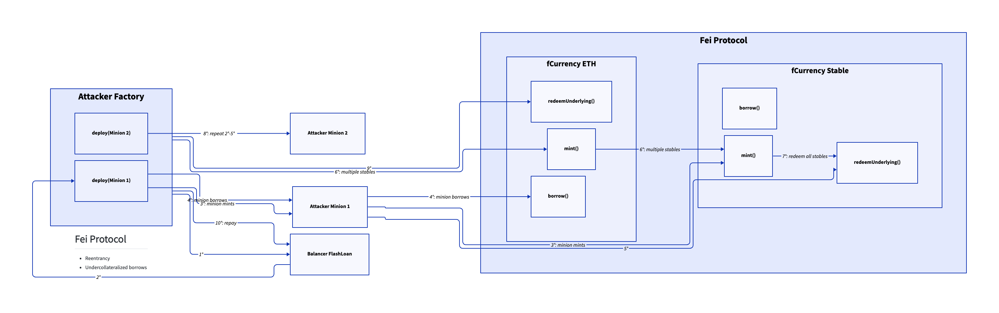
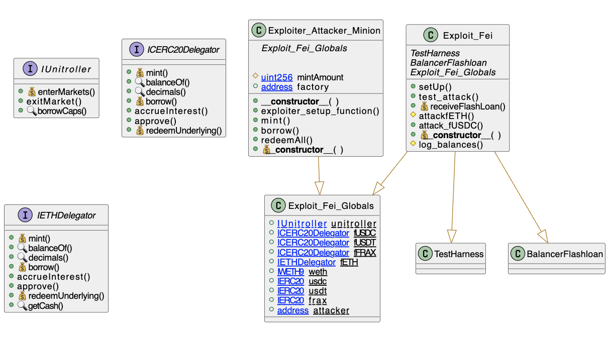

# Fei Protocol
- **Type:** Exploit
- **Network:** Mainnet
- **Total lost**: ~$80MM in various stablecoins
- **Category:** Reentrancy
- **Exploited contracts:**
- - Fei: https://etherscan.io/address/0x6162759edad730152f0df8115c698a42e666157f
- **Attack transactions:**
- - Attack Tx: https://etherscan.io/tx/0xab486012f21be741c9e674ffda227e30518e8a1e37a5f1d58d0b0d41f6e76530
- **Attack Block:**: 14684814 
- **Date:** Apr 30, 2022
- **Reproduce:** `forge test --match-contract Exploit_Fei -vvv`

## Step-by-step 
The function performs a low level call sending ETH with `doTransferOut` before updating the internal accounting for the borrower.
The fallback triggered by the low level call, calls Controller.exitMarket() which wipes the liquidity calculation of the borrower.
1. Flashloan collateral to a factory contract
2. Deploy with Create2 a borrower contract #1
3. With contract #1, mint fCURRENCY equivalent to the flashloaned amount (fei currency of certain tokens)
4. Then, borrow against the minted currency
5. Redeem the borrowed amount to recover the collateral
6. Use the factory to borrow against ETH (with fETH) more fUSDC, fUSDT and fFRAX
7. Redeem all the tokens from step 6)
8. Repeat steps 2 - 5.
9. Redeem with the factory the fETH position
10. Repay the flashloan
11. Transfer the tokens back to the attacker

## Detailed Description
An old school cross-function reentrancy attack with the root cause of not respecting the checks-effects-interactions pattern.
The attacker flashloaned multiple tokens wiping down the collateral draining the pool. 

```solidity
function borrowFresh(address payable borrower, uint borrowAmount) internal returns (uint) {
        ...
    [ComptrollerStorage.sol L802]  
        // EFFECTS & INTERACTIONS
        // (No safe failures beyond this point)

        doTransferOut(borrower, borrowAmount);

        accountBorrows[borrower].principal = vars.accountBorrowsNew;
        accountBorrows[borrower].interestIndex = borrowIndex;
        totalBorrows = vars.totalBorrowsNew;

        emit Borrow(borrower, borrowAmount, vars.accountBorrowsNew, vars.totalBorrowsNew);

        // unused function
        // comptroller.borrowVerify(address(this), borrower, borrowAmount);

        return uint(Error.NO_ERROR);
    }


    
    /// @notice Removes asset from sender's account liquidity calculation
    /// @dev Sender must not have an outstanding borrow balance in the asset,
    /// or be providing neccessary collateral for an outstanding borrow.
    /// @param cTokenAddress The address of the asset to be removed
    /// @return Whether or not the account successfully exited the market

    function exitMarket(address cTokenAddress) external returns (uint) { ... }
```

The issue was located in `CERCImplementation.borrowFresh()`, the internal function called after `borrow()` in the [CERCDelegate Contract](https://etherscan.io/address/0x67Db14E73C2Dce786B5bbBfa4D010dEab4BBFCF9#code)

The mentioned function performs the transfer via `doTransferOut()` before updating the internal variables.

## Possible mitigations
- Respect the checks-effects-interactions to prevent cross-function and single function reentrancy
- Remember that only functions that use the reetrancy mutex of the contract that implements that modifier are protected. If different contracts declare distinct reentrancy modifiers, a cross reentrancy is still open.

## Diagrams and graphs

### Overview



### Class



## Sources and references
- [Peckshield Twitter Thread](https://twitter.com/peckshield/status/1520369315698016256)
- [Certik Medium Article](https://certik.medium.com/fei-protocol-incident-analysis-8527440696cc)
