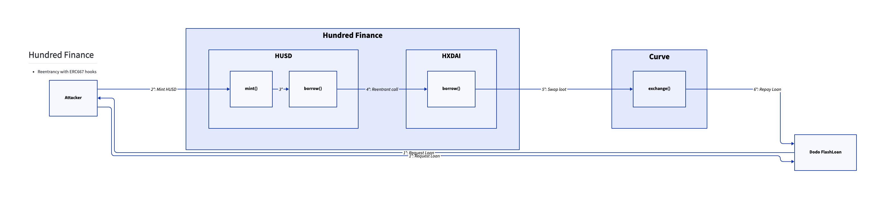
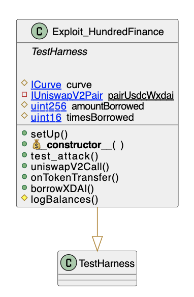

# Hundred Finance
- **Type:** Exploit
- **Network:** Gnosis Chain
- **Total lost**: ~$6MM in various stablecoins
- **Category:** Reentrancy
- **Exploited contracts:**
- - Hundred: https://gnosisscan.io/address/0x090a00A2De0EA83DEf700B5e216f87a5D4F394FE
- **Attack transactions:**
- - Attack Tx: https://gnosisscan.io/tx/0x534b84f657883ddc1b66a314e8b392feb35024afdec61dfe8e7c510cfac1a098
- **Attack Block:**: 21120320 
- **Date:** Mar 15, 2022
- **Reproduce:** `forge test --match-contract Exploit_HundredFinance -vvv`

## Step-by-step 
The function performs a low level call sending ETH with `doTransferOut` before updating the internal accounting for the borrower.

1. Flashloan collateral
2. Borrow HUSDC
3. Reenter borrowing XDAI
4. Swap earnings 
5. Repay Flashloan


## Detailed Description
The attacker managed to drain the protocol's collateral by reentering borrow calls with the `onTokenTransfer` hook of ERC667 tokens.

``` solidity
 function borrowFresh(address payable borrower, uint borrowAmount) internal returns (uint) {
        ...
        ...

        /////////////////////////
        // EFFECTS & INTERACTIONS
        // (No safe failures beyond this point)

        
          We invoke doTransferOut for the borrower and the borrowAmount.
           Note: The cToken must handle variations between ERC-20 and ETH underlying.
           On success, the cToken borrowAmount less of cash.
           doTransferOut reverts if anything goes wrong, since we can't be sure if side effects occurred.
         
        doTransferOut(borrower, borrowAmount);

        // We write the previously calculated values into storage
        accountBorrows[borrower].principal = vars.accountBorrowsNew;
        accountBorrows[borrower].interestIndex = borrowIndex;
        totalBorrows = vars.totalBorrowsNew;

        // We emit a Borrow event
        emit Borrow(borrower, borrowAmount, vars.accountBorrowsNew, vars.totalBorrowsNew);

        // We call the defense hook
        // unused function
        // comptroller.borrowVerify(address(this), borrower, borrowAmount);

        return uint(Error.NO_ERROR);
    }
```
Hundred Finance is a fork of Compound on Gnosis that implemented the `doTransferOut` hook. The main difference between Compound and Hundred is that Compound checks if the tokens used are ERC20 compliant to prevent hooks (such as 777s and 667s). The `doTransferOut()` function is invoked before updating the internal accountancy of the borrow allowing reentrancy.

The attacked [CEther Token](https://gnosisscan.io/address/0x090a00A2De0EA83DEf700B5e216f87a5D4F394FE#code) performs the transfer via `doTransferOut()` before updating the internal variables.

## Possible mitigations
- Respect the checks-effects-interactions to prevent cross-function and single function reentrancy
- Remember that only functions that use the reetrancy mutex of the contract that implements that modifier are protected. If different contracts declare distinct reentrancy modifiers, a cross reentrancy is still open.

## Diagrams and graphs

### Overview



### Class



## Sources and references
- [Peckshield Twitter Thread](https://twitter.com/peckshield/status/1520369315698016256)
- [Certik Medium Article](https://certik.medium.com/fei-protocol-incident-analysis-8527440696cc)
