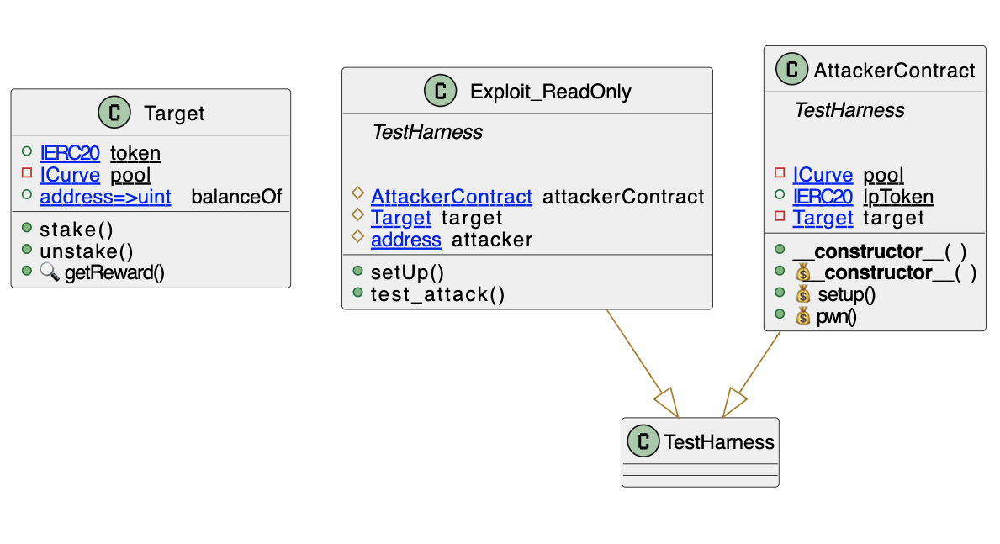

# Read Only Reentrancy
- **Type:** Education
- **Category:** Reentrancy
- **Reproduce:** `forge test --match-contract Exploit_ReadOnly -vvv`

## Step-by-step 
1) The attacker's contract calls contract A that performs a call open to be hooked (by an ERC777s, ERC1155 or regular ether transfers).
2) The attacker callbacks a contract B that reads for example totalLocked from contract A.
3) As totalLocked was not updated by the call was made, it is reading that contract's A older value (yet not updated).
4) Because of this, the attacker managed to exploit contract B because it read an invalid value of contract A (e.g. price rate manipulation).


## Detailed Description
Several recent attacks followed this novel pattern. In here, a theoretical example is provided to for educational purposes.

```solidity
    mapping(address => uint256) public userLocked;
    uint256 public totalLocked;

    function withdraw() external nonReentrant {
        require(userLocked[msg.sender] > 0);
        require(address(this).balance >= userLocked[msg.sender]);

        (bool success, ) = payable(msg.sender).call{value: userLocked[msg.sender]}();
        require(success);

        userLocked[msg.sender] = 0;
        totalLocked -= userLocked[msg.sender];
    }
```

## Possible mitigations
- For newer contracts, the state mutex of the reentrancy lock could be set as public to allow other contracts to check if they are in a reentrant call
- Also, respect the checks-effects interactions pattern as using reentrancy locks without respecting the pattern opens new attack paths like this one. 

## Diagrams and graphs

### Class



## Sources and references
- [ChainSecurity Blog: Initial report of read-only reentrancy on Curve](https://chainsecurity.com/curve-lp-oracle-manipulation-post-mortem/)
- [SmartContractProgrammer Repo](https://github.com/stakewithus/defi-by-example/blob/main/read-only-reentrancy/src/Hack.sol)

